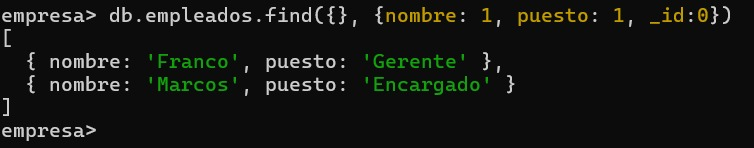
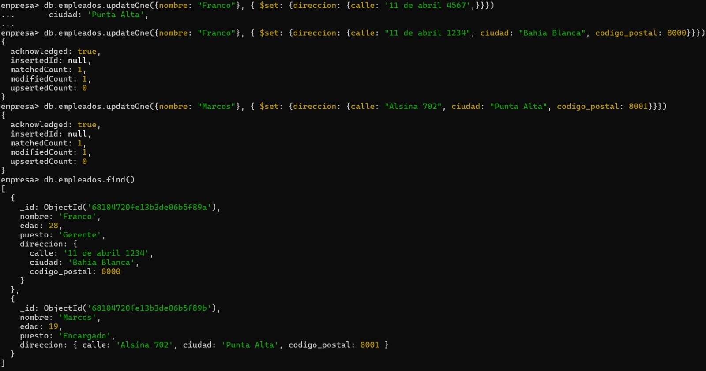

# Trabajo Practico 2 Base De Datos II

## Ejercicio 1.

Creamos la base de datos desde la consola de mongo ```use empresa```


Como siguiente paso insertamos una coleccion de empleados ```db.empleados.insertMany([{"nombre": "Mariano", "edad": 27, "puesto": "Pasante"},{"nombre": "Franco", "edad": 28, "puesto": "Gerente"}, {"nombre": "Marcos", "edad": 18, "puesto": "Encargado"}])``` y luego los mostramos ```db.empleados.find()```


Luego nos pide actualizar la edad de uno de los empleados ```db.empleados.updateOne({nombre: "Marcos"}, {$set: {edad: 19}})``` y mostramos nuevamente la lista de empleados para ver el cambio en la edad


Por ultimo eliminamos al empleado que tiene el puesto `Pasante` => ```db.empleados.deleteOne({puesto: "Pasante"})```


## Ejercicio 2.

Realizo una consulta que me traiga todos los empleados con la edad entre 25 y 40 años. => ```db.empleados.find({$and: [{edad: { $gte: 25 }}, {edad: { $lte: 40 } } ] } )```


## Ejercicio 3.

Recupero los nombres y puestos de los empleados sin el _id => ```db.empleados.find({}, {nombre: 1, puesto: 1, _id:0})```


## Ejercicio 4.

Agrego el campo direccion que incluya `calle`, `ciudad` y `codigo_postal` a traves de un updateOne a cada empleado
Marcos => ```db.empleados.updateOne({nombre: "Marcos"}, { $set: {direccion: {calle: "Alsina 702", ciudad: "Punta Alta", codigo_postal: 8001}}})```
Franco => ```db.empleados.updateOne({nombre: "Franco"}, { $set: {direccion: {calle: "11 de abril 1234", ciudad: "Bahia Blanca", codigo_postal: 8000}}})```
