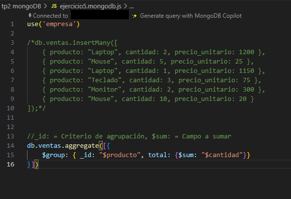
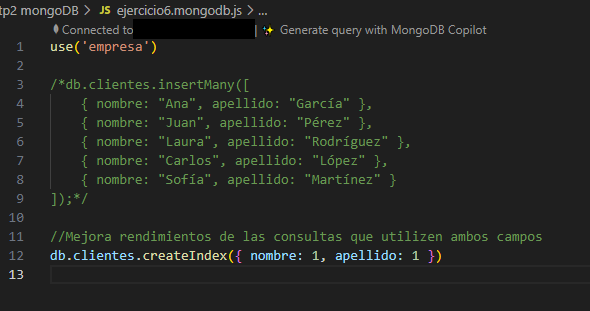
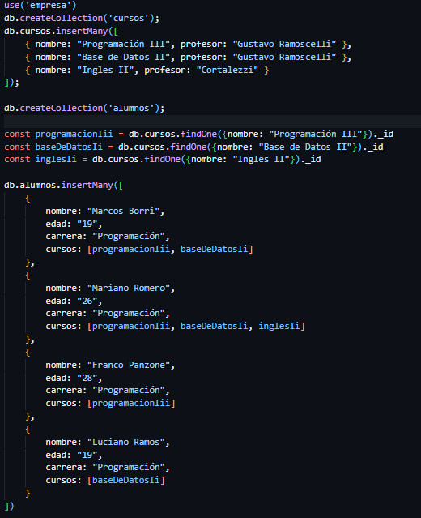

# Trabajo Practico 2 - Base De Datos II

## Ejercicio 1.

Creamos la base de datos desde la consola de mongo ```use empresa```


Como siguiente paso insertamos una coleccion de empleados ```db.empleados.insertMany([{"nombre": "Mariano", "edad": 27, "puesto": "Pasante"},{"nombre": "Franco", "edad": 28, "puesto": "Gerente"}, {"nombre": "Marcos", "edad": 18, "puesto": "Encargado"}])``` y luego los mostramos ```db.empleados.find()```


Luego nos pide actualizar la edad de uno de los empleados ```db.empleados.updateOne({nombre: "Marcos"}, {$set: {edad: 19}})``` y mostramos nuevamente la lista de empleados para ver el cambio en la edad


Por ultimo eliminamos al empleado que tiene el puesto `Pasante` - ```db.empleados.deleteOne({puesto: "Pasante"})```


## Ejercicio 2.

Realizo una consulta que me traiga todos los empleados con la edad entre 25 y 40 años. ```db.empleados.find({$and: [{edad: { $gte: 25 }}, {edad: { $lte: 40 } } ] } )```


## Ejercicio 3.

Recupero los nombres y puestos de todos los empleados, sin mostrar el _id. ```db.empleados.find({},{ "_id": 0, "nombre": 1, "puesto": 1 })```


## Ejercicio 4.

Agrego un campo direccion que incluya calle, ciudad y codigo_postal. ```db.empleados.updateMany({},{ $set: { direccion: { calle: "alem", ciudad: "Bahia Blanca", codigo_postal:"8000"}}})```


## Ejercicio 5

Se crea la tabla ventas, y luego se con $group y $sum se calcula la cantidad de ventas por productos



## Ejercicio 6

Creamos la tabla clientes y creamos un indice ascendente para los campos "nombre" y "apellido



## Ejercicio 7

Creamos la coleccion cursos y alumnos y luego obtenemos los id de los cursos para insertalos como lista a los alumnos



## Ejercicio 8

Usando &lookup hacemos una agregacion donde cada alumno tiene un array con los cursos inscriptos


## Ejercicio 9

### Replica Set
Replica Set es un conjunto de réplicas de una base de datos. Con replicas en varios servidores uno puede tener mayor disponibilidad en caso de que un servidor falle, y también mejora la eficiencia al hacer consultas porque permite que las lecturas se distribuyan en diferentes nodos y no solo en el primario.

### Sharding
Sharding es una técnica para dividir grandes cantidades de datos en fragmentos más pequeños y después distribuirlos entre varios servidores o nodos. De esta forma podemos tener una mayor cantidad de datos de manera más eficiente, dividiendo la cantidad de trabajo entre los nodos de forma paralela y así realizar consultas más rápido. Aparte al usar sharding en conjunto con Replica Set, uno asegura que en caso de que un servidor falle, el sistema continuará funcionando.

## Ejercicio 10

### Crear un Usuario con permisos de lectura y escritura
#### Paso 1: Seleccionar la base de datos en la que se desee crear el usuario
`use empresa`
#### Paso 2: Crear el usuario con permisos de lectura y escritura usando role: "readWrite"
```db.createUser({
  user: "nombre_usuario",
  pwd: "contraseña ",
  roles: [
    { role: "readWrite", db: "empresa" }
  ]
})
```
#### Paso  opcional: Verificar que el usuario fue creado
`db.getUsers()`

Muestra todos los usuarios de la base de datos actual
### Backup de una base de datos
#### Paso 1: Usar mongodump
```mongodump –db.empresa --out "/ruta a la carpeta donde poner el backup"```

### Restauracion de una base de datos
#### Paso 1: Usar mongorestore
```mongorestore --db empresa "/ruta a la carpeta con el backup"```
